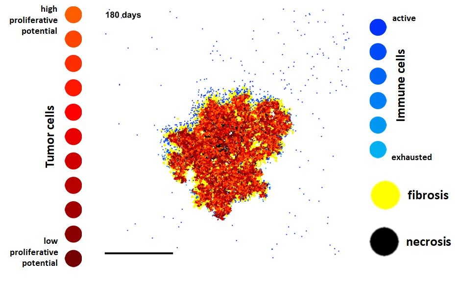

# immunoABM

## What is this?
This is an agent-based model for the interaction between solid tumors and the immune system. The model includes tumor cell agents, immune cell agents (lymphocytes), stroma and necrosis. The domain is  a two-dimensional rectangular grid. The model is written in MATLAB and was developed by JN Kather (http://orcid.org/0000-0002-3730-5348). The basic structure is similar to Jan Polesczuk's blog post here: https://computecancer.wordpress.com/2015/05/31/cancer-stem-cell-driven-tumor-growth-model-in-less-than-70-lines-of-code/

## What does it look like?

Tumor cells are red, immune cells are blue. For more detail, please refer to our paper. A movie is available in "Movie.mp4".

## License
The source code is released under a MIT open source license - please refer to the separate license file. Please cite our paper if you re-use the code. 

## Where is the actual article?
The link to the paper will be put here later.